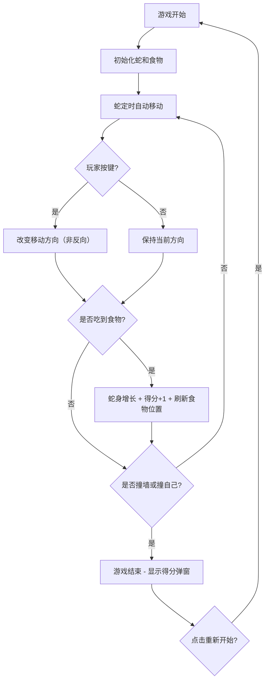

## 1. 产品概述

经典贪吃蛇网页游戏，玩家控制蛇在方格区域移动，吃食物成长，避免撞墙和撞自己。目标是获得最高分并挑战自己的记录。

- 面向所有年龄段用户的休闲娱乐小游戏
- 产品价值：提供简单有趣的经典游戏体验，支持最高分挑战

## 2. 核心功能

### 2.1 用户角色
| 角色 | 注册方式 | 核心权限 |
|------|----------|----------|
| 玩家 | 无需注册 | 开始游戏、控制蛇移动、查看得分 |

### 2.2 功能模块
1. **游戏主页面**：游戏区域、得分显示、最高记录
2. **游戏控制**：键盘方向键控制、开始/重新开始

### 2.3 页面详情
| 页面名称 | 模块名称 | 功能描述 |
|----------|----------|----------|
| 游戏主页面 | 游戏区域 | 方格地图，显示蛇和食物 |
| 游戏主页面 | 得分面板 | 右上角实时显示当前得分和最高记录 |
| 游戏主页面 | 游戏结束弹窗 | 显示最终得分，提供重新开始按钮 |

## 3. 核心流程

## 4. 用户界面设计

### 4.1 设计风格
- **主色调**：深绿色系背景，亮绿色蛇身，红色食物
- **按钮风格**：圆角按钮，悬停有轻微放大效果
- **字体**：使用现代感的等宽字体配合显示字体
- **布局风格**：居中游戏区域，右上角浮动得分面板
- **图标风格**：简洁的 emoji 图标 🍎🐍

### 4.2 页面设计概览
| 页面名称 | 模块名称 | UI 元素 |
|----------|----------|---------|
| 游戏主页面 | 游戏区域 | 深色背景网格，蛇身渐变色，食物带脉冲动画 |
| 游戏主页面 | 得分面板 | 半透明毛玻璃卡片，当前得分大号数字，最高记录小号显示 |
| 游戏主页面 | 游戏结束弹窗 | 居中模糊背景，显示最终得分、新记录标识、重新开始按钮 |

### 4.3 响应式
- 桌面端优先，游戏区域固定尺寸居中显示
- 移动端适配，游戏区域按比例缩小，支持触摸滑动控制
