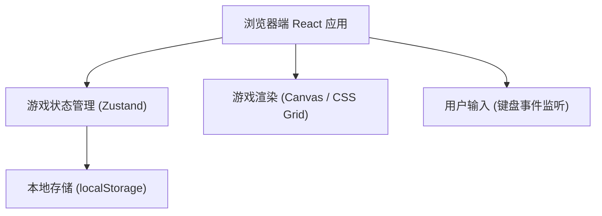

## 1. 架构设计



## 2. 技术描述

- **前端**：React@18 + TypeScript + Tailwind CSS@3 + Vite
- **初始化工具**：vite-init
- **后端**：无（纯前端应用）
- **数据存储**：浏览器 localStorage（存储最高分）
- **状态管理**：Zustand

## 3. 路由定义

| 路由 | 用途 |
|------|------|
| / | 游戏主页面 |

## 4. 数据模型

### 4.1 核心类型定义

```typescript
// 方向枚举
type Direction = 'UP' | 'DOWN' | 'LEFT' | 'RIGHT'

// 坐标点
interface Position {
  x: number
  y: number
}

// 游戏状态
interface GameState {
  snake: Position[]          // 蛇身坐标数组（第一个为蛇头）
  food: Position             // 食物坐标
  direction: Direction       // 当前移动方向
  nextDirection: Direction   // 下一步方向（防止连续按键反向）
  score: number              // 当前得分
  highScore: number          // 最高记录
  isGameOver: boolean        // 游戏是否结束
  isPlaying: boolean         // 游戏是否进行中
}

// 游戏配置
interface GameConfig {
  gridSize: number           // 方格数量（宽 x 高）
  cellSize: number           // 每格像素大小
  moveInterval: number       // 移动间隔时间（毫秒）
}
```

## 5. 模块划分

| 模块 | 文件路径 | 职责 |
|------|----------|------|
| 游戏主组件 | `src/pages/GamePage.tsx` | 页面布局和 UI 渲染 |
| 游戏区域组件 | `src/components/GameBoard.tsx` | 游戏网格、蛇和食物的渲染 |
| 得分面板组件 | `src/components/ScorePanel.tsx` | 显示当前得分和最高记录 |
| 游戏结束弹窗 | `src/components/GameOverModal.tsx` | 结束弹窗和重新开始按钮 |
| 游戏状态管理 | `src/store/useGameStore.ts` | Zustand store，管理游戏状态和逻辑 |
| 游戏常量配置 | `src/utils/constants.ts` | 游戏配置常量 |
| 游戏工具函数 | `src/utils/gameUtils.ts` | 碰撞检测、食物生成等辅助函数 |
| 键盘事件 Hook | `src/hooks/useKeyboard.ts` | 方向键监听处理 |
